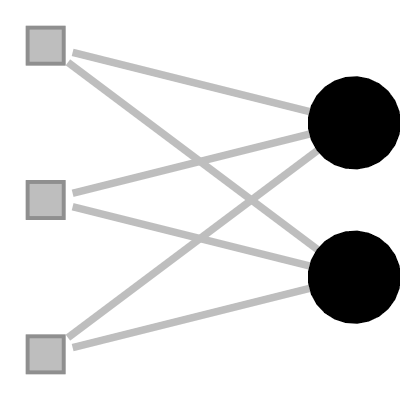
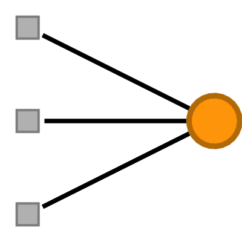
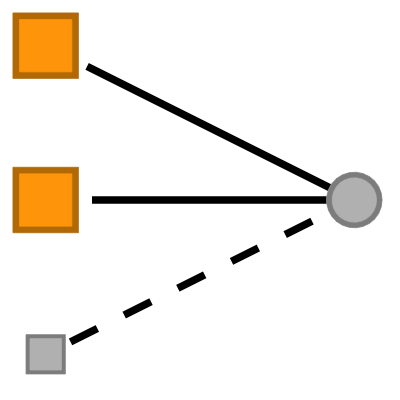

<!-- README.md is generated from README.qmd. Please edit that file -->

## tabulergm

<!-- badges: start -->

[](https://github.com/gvegayon/tabulergm/actions/workflows/R-CMD-check.yaml)
<!-- badges: end -->

`tabulergm` is an R package designed to translate models estimated with
the [`ergm`](https://cran.r-project.org/package=ergm) framework into
publication-ready tables and explanatory summaries.

## Installation

``` r
# Install from GitHub
# install.packages("remotes")
remotes::install_github("gvegayon/tabulergm")
```

## Example

Here is a simple example fitting an ERGM to the Florentine marriage
network and generating a summary table:

``` r
library(ergm)
library(tabulergm)

# Fit a simple ERGM
data(florentine)
model <- ergm(
  flomarriage ~ edges + triangle,
  control = control.ergm(seed = 42)
)

# Parse the model
model_terms <- parse_ergm_model(model)
model_terms[, c("term", "estimate", "se", "pvalue", "description")]
#>       term   estimate        se       pvalue                    description
#> 1    edges -1.6507266 0.3179320 2.079634e-07 Number of edges in the network
#> 2 triangle  0.1082377 0.5183562 8.345969e-01                      Triangles
```

You can also export the table code and generated term figures into a
folder that can be copied into another paper or report project:

``` r
tabulergm_save(
  model,
  "exports/florentine-ergm",
  include_math = TRUE
)
```

This writes Markdown and LaTeX table snippets plus a `figures/` folder
with the copied image assets.

The term dictionary also includes mode-specific terms for bipartite
ERGMs. A formula is enough to inspect the available metadata before
fitting a model:

``` r
bipartite_terms <- parse_ergm_formula(
  network ~
    gwb1dsp(0.5, fixed = TRUE) + gwb2dsp(0.5, fixed = TRUE) +
    b1factor("type") + b2factor("group") +
    b1nodematch("type") + b2nodematch("group")
)

bipartite_terms[, c("term", "attribute", "description")]
#>          term attribute
#> 1     gwb1dsp      <NA>
#> 2     gwb2dsp      <NA>
#> 3    b1factor      type
#> 4    b2factor     group
#> 5 b1nodematch      type
#> 6 b2nodematch     group
#>                                                                                       description
#> 1  Geometrically weighted dyadwise shared partner distribution for dyads in the first bipartition
#> 2 Geometrically weighted dyadwise shared partner distribution for dyads in the second bipartition
#> 3                               Factor attribute effect for the first mode in a bipartite network
#> 4                              Factor attribute effect for the second mode in a bipartite network
#> 5                Nodal attribute-based homophily effect for the first mode in a bipartite network
#> 6               Nodal attribute-based homophily effect for the second mode in a bipartite network
```

We can also embed the table in quarto/Rmarkdown:

``` r
tabulergm_table(
  network ~
    edges +
    gwb1dsp(0.5, fixed = TRUE) + gwb2dsp(0.5, fixed = TRUE) +
    b1factor("type") + b2factor("group") +
    b1nodematch("type") + b2nodematch("group"),
  format = "markdown"
)
```

| term | figure | math | description |
|:---|:---|:---|:---|
| edges |  | $\sum_{i<j} y_{ij}$ | Number of edges in the network |
| gwb1dsp |  | $\exp{(\tau)} \sum_{i=1}^{n-2} \left[1 - \left(1 - \exp{(-\tau)}\right)^m\right] P_i(y)$ | Geometrically weighted dyadwise shared partner distribution for dyads in the first bipartition |
| gwb2dsp |  | $\exp{(\tau)} \sum_{i=1}^{n-2} \left[1 - \left(1 - \exp{(-\tau)}\right)^m\right] P_i(y)$ | Geometrically weighted dyadwise shared partner distribution for dyads in the second bipartition |
| b1factor |  | $\sum_{i \in B_1} \sum_{j \in B_2} y_{ij} \mathbf{1}(x_i = k)$ | Factor attribute effect for the first mode in a bipartite network |
| b2factor |  | $\sum_{i \in B_1} \sum_{j \in B_2} y_{ij} \mathbf{1}(x_j = k)$ | Factor attribute effect for the second mode in a bipartite network |
| b1nodematch |  | $\sum_{k\in B_1} \sum_{i<j \in B_2} \mathbf{1}(x_i = x_j) y_{ik} y_{jk}$ | Nodal attribute-based homophily effect for the first mode in a bipartite network |
| b2nodematch |  | $\sum_{k\in B_2} \sum_{i<j \in B_1} \mathbf{1}(x_i = x_j) y_{ik} y_{jk}$ | Nodal attribute-based homophily effect for the second mode in a bipartite network |

## Code of Conduct

Please note that the tabulergm project is released with a [Contributor
Code of
Conduct](https://gvegayon.github.io/tabulergm/CODE_OF_CONDUCT.html). By
contributing to this project, you agree to abide by its terms.
