<!-- README.md is generated from README.qmd. Please edit that file -->

## tabulergm 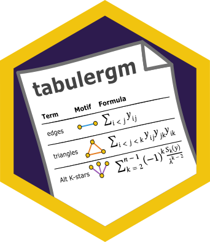

<!-- badges: start -->

[](https://github.com/gvegayon/tabulergm/actions/workflows/R-CMD-check.yaml)
<!-- badges: end -->

The `tabulergm` package provides an easy way to generate
publication-ready tables and explanatory summaries for
Exponential-Random Graph Family Models \[ERGMs\]. Users can generate
tables either directly from fitted models or by parsing a formula to
inspect the available terms and their metadata. Generated tables can be
incorporated into Quarto or RMarkdown documents, and can also be
exported as Markdown or LaTeX snippets for use in other projects.

The package includes a term dictionary with metadata for each term: a
short title, a plain-language description, a LaTeX definition, an
example figure, and – where the term has an identifiable source – a
citation. Figures are currently drawn using the
[`netplot`](https://cran.r-project.org/package=netplot) package, but
users can also provide their own custom figure generation methods. Every
text field can be replaced on a per-table basis without editing the
dictionary (see [Customizing term
metadata](#customizing-term-metadata)).

Future version of this package may extend its functionality to support
stochastic actor-oriented models (SAOMs) and other network modeling
frameworks.

## Installation

``` r
# From CRAN
install.packages("tabulergm")

# Development version from GitHub
# install.packages("remotes")
remotes::install_github("gvegayon/tabulergm")
```

## Example

Here is a simple example fitting an ERGM to the Florentine marriage
network and generating a summary table:

``` r
library(ergm)
library(tabulergm)

# Fit a simple ERGM
data(florentine)
model <- ergm(
  flomarriage ~ edges + triangle,
  control = control.ergm(seed = 42)
)

# Parse the model
model_terms <- parse_ergm_model(model)
model_terms[, c("term", "title", "estimate", "se", "pvalue")]
#>       term           title   estimate        se       pvalue
#> 1    edges Number of edges -1.6507266 0.3179320 2.079634e-07
#> 2 triangle       Triangles  0.1082377 0.5183562 8.345969e-01
```

You can also export the table code and generated term figures into a
folder that can be copied into another paper or report project:

``` r
tabulergm_save(
  model,
  "exports/florentine-ergm",
  include_math = TRUE
)
```

This writes Markdown and LaTeX table snippets plus a `figures/` folder
with the copied image assets.

The term dictionary also includes mode-specific terms for bipartite
ERGMs. A formula is enough to inspect the available metadata before
fitting a model:

``` r
bipartite_terms <- parse_ergm_formula(
  network ~
    gwb1dsp(0.5, fixed = TRUE) + gwb2dsp(0.5, fixed = TRUE) +
    b1factor("type") + b2factor("group") +
    b1nodematch("type") + b2nodematch("group")
)

bipartite_terms[, c("term", "attribute", "title")]
#>          term attribute
#> 1     gwb1dsp      <NA>
#> 2     gwb2dsp      <NA>
#> 3    b1factor      type
#> 4    b2factor     group
#> 5 b1nodematch      type
#> 6 b2nodematch     group
#>                                                           title
#> 1  Geometrically weighted dyadwise shared partners (first mode)
#> 2 Geometrically weighted dyadwise shared partners (second mode)
#> 3                                 First-mode attribute activity
#> 4                                Second-mode attribute activity
#> 5                                          First-mode homophily
#> 6                                         Second-mode homophily
```

## Customizing term metadata

Titles and descriptions come from the term dictionary, falling back to
the `ergm` term database for terms the dictionary does not cover. Either
can be replaced for a single table with the `override.*` arguments,
which are keyed by term name:

``` r
custom <- tabulergm_table(
  model,
  include_title  = TRUE,
  override.title = c(edges = "Density"),
  override.desc  = c(edges = "Baseline propensity to form ties.")
)

custom[, c("term", "title")]
#>                   term     title
#> 1                edges   Density
#> 2 triangle (frank1986) Triangles
```

`triangle` picks up a `(frank1986)` marker because it carries a citation
in the term dictionary. The marker attaches to the description when that
column is shown and to the term otherwise, so a citation is never
silently dropped.

The same works for `math`, `figure`, and `citation`, and a single
`override` list can set several fields of several terms at once:

``` r
tabulergm_table(
  model,
  override = list(
    edges     = list(title = "Density", desc = "Baseline tie propensity."),
    nodematch = list(citation = "doi:10.1146/annurev.soc.27.1.415")
  )
)
```

Terms that carry a citation get a `(key)` marker next to their
description, and the matching reference is appended below the table.
Storing a DOI, arXiv id, or PubMed id (rather than a formatted
reference) lets readers pull the full citation into their own
bibliography software:

``` r
tabulergm_table(
  network ~ gwesp(0.5, fixed = TRUE) + triangle,
  format = "markdown"
)
```

| term | figure | math | description |
|:---|:---|:---|:---|
| gwesp | 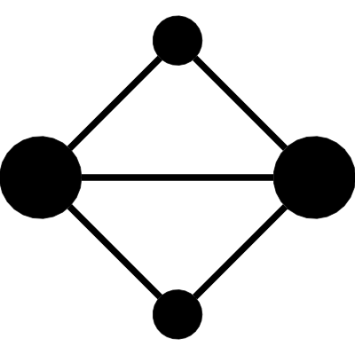 | $\exp{(\tau)} \sum_{i=1}^{n-2} \left[1 - \left(1 - \exp{(-\tau)}\right)^i\right] EP_i(y)$ | Summarizes how many partners tied nodes share, weighting each additional shared partner geometrically less than the last. Provides a better-behaved measure of transitive closure than a raw triangle count; the decay parameter controls how fast the weights fall off. (hunter2007) |
| triangle | 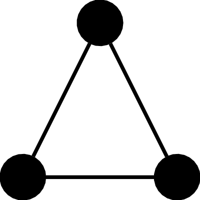 | $\sum_{i<j<k} y_{ij} y_{jk} y_{ik}$ | Counts the sets of three mutually connected nodes, the basic measure of local clustering in an undirected network. (frank1986) |

*\[hunter2007\]
[doi:10.1016/j.socnet.2006.08.005](https://doi.org/10.1016/j.socnet.2006.08.005)*\
*\[frank1986\]
[doi:10.1080/01621459.1986.10478342](https://doi.org/10.1080/01621459.1986.10478342)*

## The term dictionary

We can also embed the table in quarto/Rmarkdown. The table below covers
every term currently included in `tabulergm`’s term dictionary; terms
with both directed and undirected definitions (`edges`, `gwesp`,
`gwdsp`) display the undirected version:

``` r
dictionary_terms <- network ~
  edges + mutual + triangle +
  gwesp(0.5, fixed = TRUE) + gwdsp(0.5, fixed = TRUE) +
  gwdegree(0.5, fixed = TRUE) + altkstar(2, fixed = TRUE) +
  nodematch("attr") + nodefactor("attr") + nodemix("attr") +
  nodecov("attr") + absdiff("attr") + edgecov("cov") +
  transitiveties + cyclicalties +
  nodeicov("attr") + nodeocov("attr") +
  gwb1dsp(0.5, fixed = TRUE) + gwb2dsp(0.5, fixed = TRUE) +
  b1factor("type") + b2factor("group") +
  b1nodematch("type") + b2nodematch("group") +
  b1starmix(2, "type") + b2starmix(2, "group")

tabulergm_table(dictionary_terms, format = "markdown")
```

| term | figure | math | description |
|:---|:---|:---|:---|
| edges |  | $\sum_{i<j} y_{ij}$ | Counts the ties present in the network. Acts as the baseline density term, playing the role an intercept plays in a regression model. |
| mutual |  | $\sum_{i<j} y_{ij} y_{ji}$ | Counts the dyads in which both directed ties are present, capturing the tendency for ties to be returned. (holland1981) |
| triangle |  | $\sum_{i<j<k} y_{ij} y_{jk} y_{ik}$ | Counts the sets of three mutually connected nodes, the basic measure of local clustering in an undirected network. (frank1986) |
| gwesp |  | $\exp{(\tau)} \sum_{i=1}^{n-2} \left[1 - \left(1 - \exp{(-\tau)}\right)^i\right] EP_i(y)$ | Summarizes how many partners tied nodes share, weighting each additional shared partner geometrically less than the last. Provides a better-behaved measure of transitive closure than a raw triangle count; the decay parameter controls how fast the weights fall off. (hunter2007) |
| gwdsp | 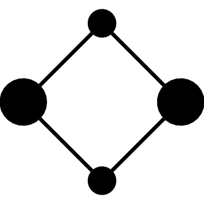 | $\exp{(\tau)} \sum_{i=1}^{n-2} \left[1 - \left(1 - \exp{(-\tau)}\right)^i\right] DP_i(y)$ | Summarizes shared partners over every dyad, tied or not, with geometrically decreasing weights. Commonly paired with gwesp to separate shared partnership from closure itself. (hunter2007) |
| gwdegree | 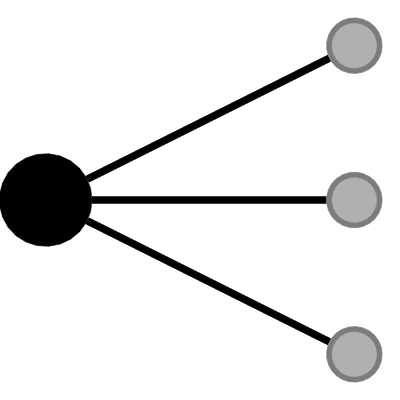 | $\exp{(\tau)} \sum_{i=1}^{n-1} \left[1 - \left(1 - \exp{(-\tau)}\right)^i\right] D_i(y)$ | Summarizes the degree distribution with geometrically decreasing weights. Captures whether ties concentrate on a few high-degree nodes or spread evenly, and stabilizes models that would otherwise degenerate. (snijders2006; hunter2007) |
| altkstar | 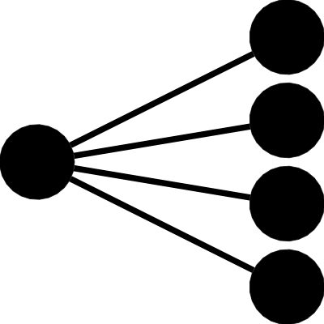 | $\sum_{k=2}^{n-1} (-1)^k \frac{S_k(y)}{\lambda^{k-2}}$ | Alternating sum of the k-star counts, an equivalent parameterization of the geometrically weighted degree distribution used to model degree heterogeneity. (snijders2006; hunter2007) |
| nodematch | 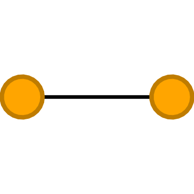 | $\sum_{i<j} y_{ij} \mathbf{1}(x_i = x_j)$ | Counts the ties joining nodes that share the same value of a categorical attribute, the standard measure of homophily. Setting diff = TRUE adds one statistic per attribute value (differential homophily). (mcpherson2001) |
| nodefactor | 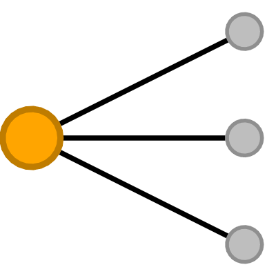 | $\sum_{i<j} y_{ij} \left[\mathbf{1}(x_i = k) + \mathbf{1}(x_j = k)\right]$ | Counts the tie endpoints belonging to each level of a categorical attribute, measuring how active nodes with that value are in forming ties. |
| nodemix | 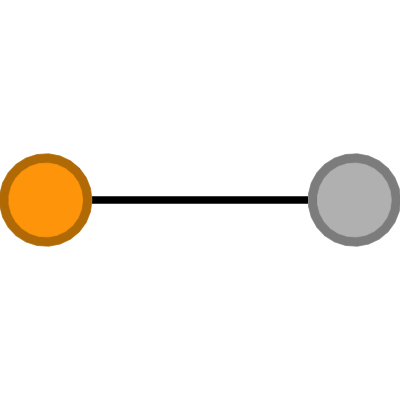 | $\sum_{i<j} y_{ij} \mathbf{1}(\{x_i, x_j\} = \{k, l\})$ | Counts the ties for every pairing of attribute values, reproducing the full mixing matrix of a categorical attribute. |
| nodecov |  | $\sum_{i<j} y_{ij} (x_i + x_j)$ | Sums a quantitative attribute over both ends of each tie, measuring how strongly that attribute drives tie formation. |
| absdiff | 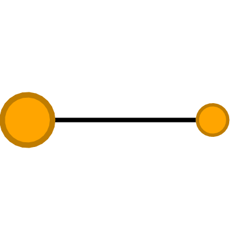 | $\sum_{i<j} y_{ij} \left\lvert{}x_i - x_j\right\rvert{}$ | Sums the absolute difference in a quantitative attribute across tied nodes. Negative estimates indicate homophily, since similar nodes contribute less. |
| edgecov | 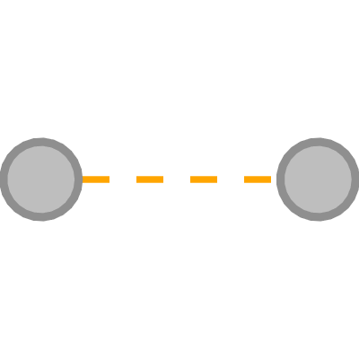 | $\sum_{i<j} y_{ij} x_{ij}$ | Sums a fixed dyad-level covariate over the observed ties, letting an external matrix such as distance or a previously observed network predict tie formation. |
| transitiveties | 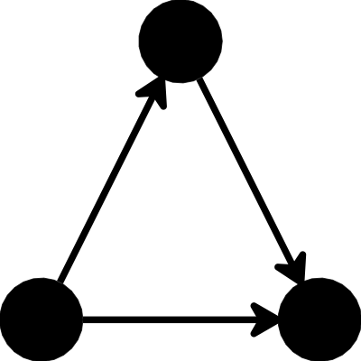 | $\sum_{i \neq j} y_{ij} \mathbf{1}\left(\exists k : y_{ik} y_{kj} = 1\right)$ | Counts the ties closed by at least one two-path. Unlike a triple count, a tie contributes once no matter how many shared partners it has. |
| cyclicalties | 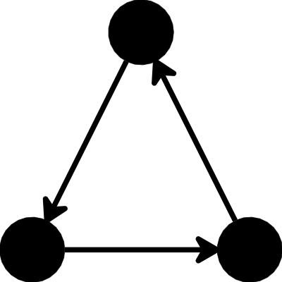 | $\sum_{i \neq j} y_{ij} \mathbf{1}\left(\exists k : y_{jk} y_{ki} = 1\right)$ | Counts the ties that take part in at least one cycle, capturing generalized exchange rather than hierarchy. |
| nodeicov | 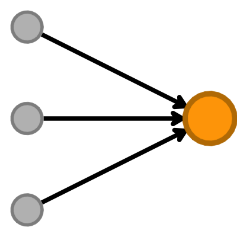 | $\sum_{i \neq j} y_{ij} x_j$ | Sums the receiving node’s attribute value over all ties, measuring how a quantitative attribute drives incoming ties (popularity). |
| nodeocov |  | $\sum_{i \neq j} y_{ij} x_i$ | Sums the sending node’s attribute value over all ties, measuring how a quantitative attribute drives outgoing ties (activity). |
| gwb1dsp |  | $\exp{(\tau)} \sum_{i=1}^{n_{B_2}} \left[1 - \left(1 - \exp{(-\tau)}\right)^i\right] DP_i(y)$ | Summarizes how many second-mode nodes each pair of first-mode nodes has in common, weighting additional shared partners geometrically less. |
| gwb2dsp | 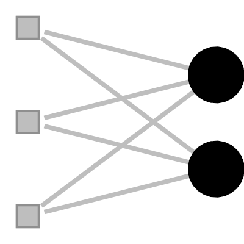 | $\exp{(\tau)} \sum_{i=1}^{n_{B_1}} \left[1 - \left(1 - \exp{(-\tau)}\right)^i\right] DP_i(y)$ | Summarizes how many first-mode nodes each pair of second-mode nodes has in common, weighting additional shared partners geometrically less. |
| b1factor | 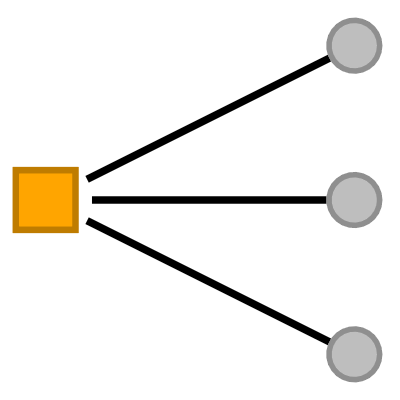 | $\sum_{i \in B_1} \sum_{j \in B_2} y_{ij} \mathbf{1}(x_i = k)$ | Counts the ties incident on first-mode nodes at each level of a categorical attribute, measuring how active those nodes are. |
| b2factor | 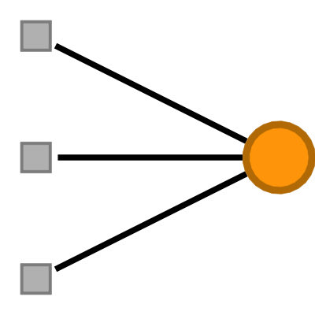 | $\sum_{i \in B_1} \sum_{j \in B_2} y_{ij} \mathbf{1}(x_j = k)$ | Counts the ties incident on second-mode nodes at each level of a categorical attribute, measuring how active those nodes are. |
| b1nodematch |  | $\sum_{k\in B_2} \sum_{i<j \in B_1} \mathbf{1}(x_i = x_j) y_{ik} y_{jk}$ | Counts the pairs of first-mode nodes that share an attribute value and are both tied to the same second-mode node. The alpha and beta discount parameters temper the count when nodes share many partners. (bomiriya2014) |
| b2nodematch | 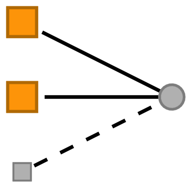 | $\sum_{k\in B_1} \sum_{i<j \in B_2} \mathbf{1}(x_i = x_j) y_{ik} y_{jk}$ | Counts the pairs of second-mode nodes that share an attribute value and are both tied to the same first-mode node. The alpha and beta discount parameters temper the count when nodes share many partners. (bomiriya2014) |
| b1starmix | 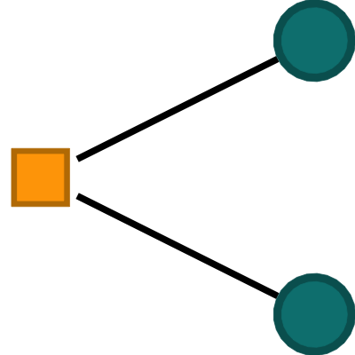 | $\sum_{i \in B_1} \mathbf{1}(x_i = p) \sum_{j_1 < \cdots < j_k \in B_2} \prod_{l=1}^{k} y_{i j_l} \mathbf{1}(x_{j_l} = q)$ | Counts the k-stars centered on a first-mode node with one attribute value whose second-mode neighbors all share another, capturing mixing and degree together. |
| b2starmix | 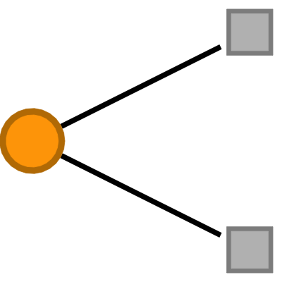 | $\sum_{j \in B_2} \mathbf{1}(x_j = p) \sum_{i_1 < \cdots < i_k \in B_1} \prod_{l=1}^{k} y_{i_l j} \mathbf{1}(x_{i_l} = q)$ | Counts the k-stars centered on a second-mode node with one attribute value whose first-mode neighbors all share another, capturing mixing and degree together. |

*Note: Orange nodes indicate nodes with a focal attribute. Orange and
teal nodes represent nodes with different values of the focal attribute.
Square nodes represent nodes in the first mode and circle nodes in the
second mode.*

*\[holland1981\]
[doi:10.1080/01621459.1981.10477598](https://doi.org/10.1080/01621459.1981.10477598)*\
*\[frank1986\]
[doi:10.1080/01621459.1986.10478342](https://doi.org/10.1080/01621459.1986.10478342)*\
*\[hunter2007\]
[doi:10.1016/j.socnet.2006.08.005](https://doi.org/10.1016/j.socnet.2006.08.005)*\
*\[snijders2006\]
[doi:10.1111/j.1467-9531.2006.00176.x](https://doi.org/10.1111/j.1467-9531.2006.00176.x)*\
*\[mcpherson2001\]
[doi:10.1146/annurev.soc.27.1.415](https://doi.org/10.1146/annurev.soc.27.1.415)*\
*\[bomiriya2014\]
[doi:10.48550/arXiv.2312.05673](https://doi.org/10.48550/arXiv.2312.05673)*

## Code of Conduct

Please note that the tabulergm project is released with a [Contributor
Code of
Conduct](https://gvegayon.github.io/tabulergm/CODE_OF_CONDUCT.html). By
contributing to this project, you agree to abide by its terms.
